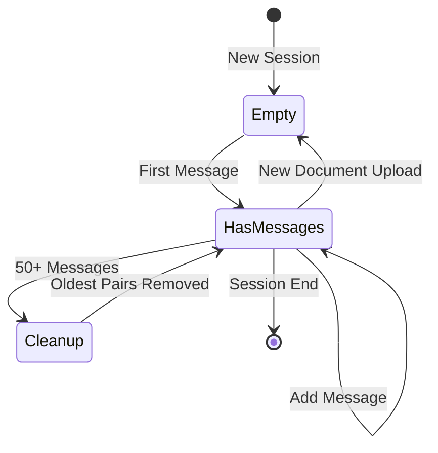
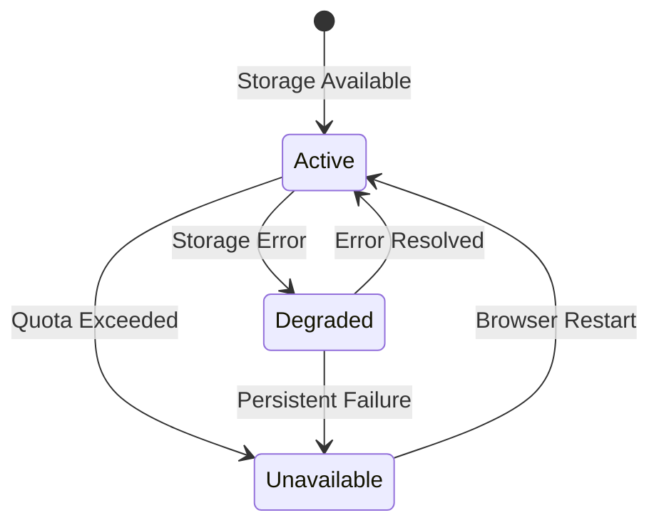

# Data Model: Session State Chat History

**Feature**: Session state chat history implementation  
**Date**: 2025-10-25  
**Phase**: Phase 1 - Design & Contracts  

## Core Entities

### ChatMessage

Represents a single message in the conversation history.

**Fields:**
- `role: str` - Message sender role ("user" | "assistant")
- `content: str` - The message text content
- `timestamp: str` - ISO 8601 timestamp of message creation
- `metadata: dict` - Optional metadata container

**Validation Rules:**
- `role` must be either "user" or "assistant"
- `content` must be non-empty string, max 10,000 characters
- `timestamp` must be valid ISO 8601 format
- `metadata` must be serializable dictionary (optional)

**Example:**
```python
{
    "role": "user",
    "content": "What is the main topic of this document?",
    "timestamp": "2025-10-25T14:30:15.123Z",
    "metadata": {
        "message_id": "f47ac10b-58cc-4372-a567-0e02b2c3d479",
        "document_name": "example.pdf"
    }
}
```

### SessionState

Container for all session-related data and conversation state.

**Fields:**
- `chat_history: List[ChatMessage]` - Ordered list of conversation messages
- `document_metadata: dict` - Information about currently loaded document
- `vector_store_ready: bool` - Status of FAISS vector store initialization
- `storage_status: str` - Status of sessionStorage availability
- `session_id: str` - Unique identifier for the current session

**Validation Rules:**
- `chat_history` maximum 50 messages (enforced by cleanup)
- `document_metadata` contains at least "name" and "processed_at" if document loaded
- `vector_store_ready` boolean flag for UI state management
- `storage_status` one of: "active", "degraded", "unavailable"
- `session_id` generated once per browser session

**Example:**
```python
{
    "chat_history": [
        # List of ChatMessage objects
    ],
    "document_metadata": {
        "name": "example.pdf",
        "size_bytes": 245760,
        "pages": 15,
        "processed_at": "2025-10-25T14:25:00.000Z"
    },
    "vector_store_ready": True,
    "storage_status": "active",
    "session_id": "session_a1b2c3d4e5f6"
}
```

### ConversationContext

Aggregated view of conversation history for contextual response generation.

**Fields:**
- `recent_exchanges: List[dict]` - Last N Q&A pairs for immediate context
- `conversation_summary: str` - Brief summary of conversation topics
- `document_context: dict` - Document-related context information
- `total_messages: int` - Count of total messages in session

**Validation Rules:**
- `recent_exchanges` contains up to 5 most recent Q&A pairs
- `conversation_summary` generated automatically, max 500 characters
- `document_context` includes document name and key topics
- `total_messages` accurate count for UI display

**Example:**
```python
{
    "recent_exchanges": [
        {
            "user": "What is the main topic?",
            "assistant": "The document discusses renewable energy technologies...",
            "timestamp": "2025-10-25T14:30:15Z"
        }
    ],
    "conversation_summary": "Discussion about renewable energy technologies, focusing on solar panels and wind power efficiency.",
    "document_context": {
        "document_name": "renewable_energy_report.pdf",
        "main_topics": ["solar energy", "wind power", "efficiency metrics"]
    },
    "total_messages": 8
}
```

## State Transitions

### Chat History Lifecycle



### Storage Status Transitions



## Relationships

### Message Ordering
- Messages are stored in chronological order (insertion order)
- Each message has a timestamp for absolute ordering
- Q&A pairs are logically grouped but stored as separate messages
- Cleanup maintains message pair boundaries

### Session Isolation
- Each browser session has unique SessionState instance
- Multiple tabs create separate sessions (Streamlit default behavior)
- No cross-session data sharing or communication
- Session data cleared when browser closes (sessionStorage behavior)

### Document Association
- Chat history is tied to current document context
- New document upload clears all previous chat history
- Document metadata stored alongside chat for context
- Vector store state synchronized with document lifecycle

## Serialization Format

### SessionStorage Schema

The data stored in browser sessionStorage follows this JSON schema:

```json
{
  "chatbot_session": {
    "version": "1.0",
    "session_id": "string",
    "last_updated": "ISO8601 timestamp",
    "chat_history": [
      {
        "role": "string (user|assistant)",
        "content": "string",
        "timestamp": "ISO8601 timestamp", 
        "metadata": {}
      }
    ],
    "document_metadata": {
      "name": "string",
      "size_bytes": "number",
      "pages": "number",
      "processed_at": "ISO8601 timestamp"
    },
    "storage_status": "string (active|degraded|unavailable)"
  }
}
```

### Streamlit Session State Mapping

```python
# Direct mapping from sessionStorage to st.session_state
st.session_state.chat_history = loaded_data["chat_history"]
st.session_state.document_metadata = loaded_data["document_metadata"]
st.session_state.vector_store_ready = compute_from_document_metadata()
st.session_state.storage_status = loaded_data["storage_status"]
st.session_state.session_id = loaded_data["session_id"]
```

## Data Constraints

### Size Limitations
- Maximum 50 messages per session (25 Q&A exchanges)
- Maximum 10,000 characters per message content
- Total sessionStorage usage target: <50KB per session
- Metadata fields limited to 1KB per message

### Performance Constraints
- Chat history rendering: <100ms for full list
- Storage operations: <50ms for save/load
- Cleanup operations: <10ms for 50 message cleanup
- Serialization: <25ms for full session data

### Browser Compatibility
- SessionStorage support: IE8+ (universal modern browser support)
- JSON serialization: Native browser support
- Streamlit components: Chrome, Firefox, Safari, Edge latest versions
- Mobile browsers: iOS Safari, Chrome Mobile

## Error Handling

### Data Corruption Recovery
- Invalid JSON: Reset to empty chat history
- Missing required fields: Use default values
- Type mismatches: Convert or discard malformed data
- Oversized data: Truncate and log warning

### Storage Failures
- Quota exceeded: Clear oldest data, retry operation
- Private browsing: Continue without persistence, show warning
- Network issues: Retry on next user action
- Browser compatibility: Graceful degradation to in-memory only

## Migration Strategy

### Version Compatibility
- Schema version field enables future migrations
- Backward compatibility for at least 2 schema versions
- Forward compatibility through optional field handling
- Migration scripts for breaking changes

### Data Evolution
- New metadata fields: Optional with defaults
- Changed field types: Convert with fallbacks
- Removed fields: Ignore during deserialization
- Restructured data: Migration functions per version bump

This data model provides a solid foundation for implementing session state chat history while maintaining simplicity, performance, and reliability requirements.